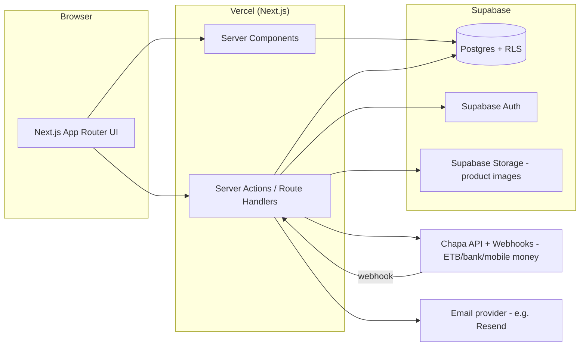

# Architecture

## High-Level Diagram



## Layers

- **Client**: Next.js pages (App Router) — Server Components for data-heavy pages, Client
  Components only where interactivity is needed (cart button, search input, checkout form).
- **Server logic**: Server Actions / Route Handlers do all writes — orders, stock, Chapa calls.
  The client never talks to Supabase directly for anything sensitive.
- **Supabase**: Postgres, Auth (JWT sessions), Storage. RLS enforces that customers only
  see/edit their own rows (full policies in `database.md`).
- **Chapa**: server initializes each transaction (`transaction/initialize`) and redirects the
  customer to Chapa's hosted checkout. The webhook/callback triggers a server-side
  `transaction/verify/{tx_ref}` call — that verify response, not the webhook payload or the
  client redirect, is the trusted "payment succeeded" signal.
- **Email**: transactional emails (order confirmation, shipping update) via a provider like
  Resend, triggered server-side after DB writes.

## Repo / Folder Structure

```
my-project/
├── frontend/          Next.js app (UI + all server logic)
│   ├── app/
│   ├── components/
│   ├── lib/supabase/
│   └── public/
├── backend/           Supabase config only (migrations, seed, edge functions)
│   └── supabase/
├── docs/              This documentation
├── docker/            Dockerfiles
├── .github/workflows/ CI/CD
├── docker-compose.yml
└── README.md
```

Inside `frontend/app`, group routes by area as they're built:
```
app/
  (storefront)/
    page.tsx                # home
    products/[slug]/page.tsx
    cart/page.tsx
    checkout/page.tsx
    orders/page.tsx
    orders/[id]/page.tsx
  (admin)/
    admin/page.tsx
    admin/products/page.tsx
    admin/orders/page.tsx
  api/
    webhooks/chapa/route.ts
```

---

## Architecture Decision Records (ADR)

Short log of key decisions: context, decision, consequence.

### D-001: Merge "Seller Dashboard" into "Admin Dashboard"
**Context**: Single-store project — one seller (the owner), not a marketplace.
**Decision**: One admin dashboard covers all owner/staff needs; no separate seller role/dashboard.
**Consequence**: No multi-seller data model. Revisit only if this becomes a marketplace.

### D-002: Next.js App Router + Supabase over a separate backend
**Context**: Needed an architecture that's fast to build and cheap to run for an MVP.
**Decision**: Next.js handles both frontend and backend logic; Supabase provides Postgres,
Auth, and Storage. No custom Express/NestJS API.
**Consequence**: Less flexible than a fully custom backend, but far less boilerplate. Revisit
only if we outgrow Supabase's limits.

### D-003: Payment-provider webhook is never trusted alone
**Context**: A client-side redirect or raw webhook payload can be spoofed, delayed, or replayed.
**Decision**: An order is only marked `paid` — and stock only decremented — after the server
independently calls the payment provider's verify-transaction endpoint.
**Consequence**: Slightly more setup, but eliminates "I paid but my order shows pending" bugs
and a class of fraud risk.

### D-004: Row Level Security (RLS) on every table, no exceptions
**Context**: Supabase's client SDK can be called directly from the browser, so the database
itself must enforce access control.
**Decision**: RLS enabled on all tables from day one; `payments` has no client-facing policy at
all (server-only, via service role key).
**Consequence**: More upfront policy-writing, but removes a whole category of "forgot to check
permissions in the API" bugs.

### D-005: Lean MVP scope — cut variants, multi-currency, recommendations
**Context**: Full feature wishlist included product variants and richer personalization.
**Decision**: Deferred to ship a working store first (see `requirements.md` → Out of Scope).
**Consequence**: MVP treats each product as a single SKU. Revisit schema if variants are added.

### D-006: Chapa over Stripe for payments
**Context**: Store is Ethiopia-based; customers pay in Birr (ETB) via local bank transfer and
mobile money (Telebirr, CBE Birr, etc.), which Stripe does not support.
**Decision**: Use Chapa. Server initializes each transaction via `transaction/initialize`,
redirects to Chapa's hosted checkout, and on webhook/callback independently calls
`transaction/verify/{tx_ref}` before marking an order paid (same principle as D-003).
**Consequence**: No card-only assumption in the checkout UI/copy; amounts always in ETB.
Refunds handled manually via Chapa's dashboard/API for MVP.

### D-007: Recommendations kept simple (category-based) for MVP
**Context**: True personalized recommendations need meaningful order/browsing volume and add
real engineering cost.
**Decision**: MVP "recommendations" = same-category products on the product page, plus optional
"you may also like" on cart/confirmation. No ML, no separate recommendations table.
**Consequence**: Cheap, works from day one with zero data. Revisit once order volume justifies
a smarter engine — a fast-follow, not a launch blocker.

*(Add new entries below as decisions are made.)*
