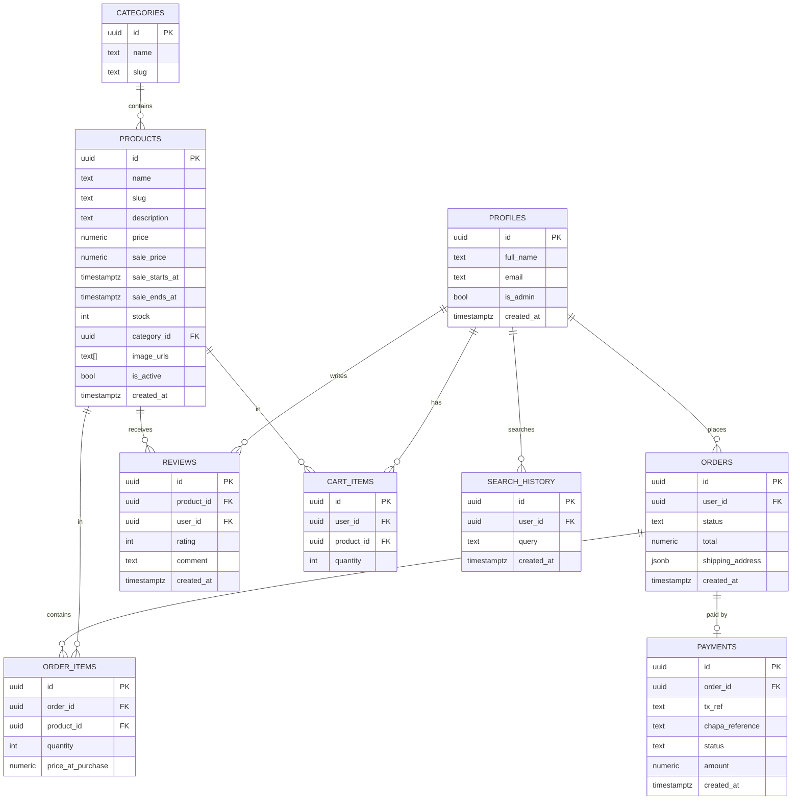

# Database Design (Supabase / Postgres)

> Schema lives as executable SQL in `../backend/supabase/migrations/0001_init.sql` — this doc
> explains the *why*; the migration file is the source of truth for the *what*.

## ER Diagram

## Notes
- `profiles.id` mirrors Supabase Auth's `auth.users.id` (1:1), extended with app-specific fields (`is_admin`).
- `products.price` and `order_items.price_at_purchase` are separate on purpose — an order must
  keep the price at time of purchase, unaffected by later price changes.
- `products.sale_price` + `sale_starts_at`/`sale_ends_at`: a product is "on sale" when
  `sale_price is not null` and the current time falls in that window. The storefront reads
  `sale_price` if active, otherwise `price`. No separate discounts/coupons table for MVP —
  simple per-product sale pricing only (coupon codes deferred, see `11-decisions.md`).
- "New Arrivals" needs no new field — it's just `products` ordered by `created_at desc`,
  filtered to `is_active = true`.
- "Related products" (recommendations) needs no new field either for MVP — it's `products`
  in the same `category_id`, excluding the current product, ordered by `created_at desc` or
  randomly. See `11-decisions.md` (D-007) for why a full recommendation engine is deferred.
- `search_history`: one row per search query a logged-in user makes. Used to show "recent
  searches" (last N rows for that user) and, aggregated across users, "trending searches."
  Anonymous/guest search history is not persisted for MVP (kept client-side only, if at all).
- `orders.status` is a text enum: `pending | paid | shipped | delivered | cancelled`.
- Stock decrement happens in the same transaction as marking an order `paid` (triggered after
  the Chapa webhook handler independently verifies the transaction), not at "add to cart" time.

## Row Level Security (RLS) — summary (full policy detail in `08-security.md`)
- `profiles`: user can read/update only their own row; `is_admin` is not user-editable.
- `products`, `categories`: public read; write restricted to `is_admin = true`.
- `cart_items`, `orders`, `order_items`: user can read/write only rows where `user_id = auth.uid()`;
  admins can read all.
- `payments`: no direct client access — written only by the server (webhook handler) using the
  service role key.
- `reviews`: public read; insert restricted to users who have a `delivered` order containing that product.
- `search_history`: user can read/write only their own rows; trending-search aggregation is
  computed server-side (service role key), not exposed as a raw client query.
