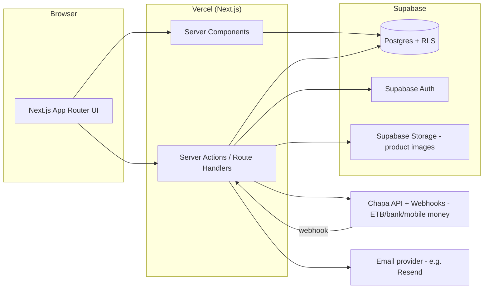

# 04 — System Architecture

## High-Level Diagram



## Layers

- **Client**: Next.js pages (App Router), mostly Server Components for data-heavy pages
  (product list, product detail), Client Components only where interactivity is needed
  (cart button, search input, checkout form).
- **Server logic**: Server Actions / Route Handlers do all writes — creating orders, updating
  stock, calling Stripe. Client never talks to Supabase directly for anything sensitive.
- **Supabase**: Postgres database, Auth (JWT-based sessions), Storage (product images).
  RLS policies enforce that customers only see/edit their own rows.
- **Chapa**: Server initializes each transaction (`transaction/initialize`) and redirects the
  customer to Chapa's hosted checkout. The webhook/callback triggers a server-side
  `transaction/verify/{tx_ref}` call — that verify response, not the webhook payload or the
  client redirect, is the trusted "payment succeeded" signal.
- **Email**: Transactional emails (order confirmation, shipping update) via a provider like Resend
  or Supabase's own SMTP integration — triggered from server-side after DB writes.

## Key Architectural Decisions (summary — full reasoning in `11-decisions.md`)
- Next.js App Router chosen for combined frontend+backend in one deployable unit.
- Supabase chosen over a custom backend for fast auth + Postgres + storage out of the box.
- All price/stock logic is server-authoritative — the client is never trusted with financial data.
- Chapa chosen over Stripe for native ETB support and local bank/mobile-money rails.
- Chapa's verify-transaction endpoint (not the webhook payload or client redirect) is the single source of truth for "order paid."

## Folder Structure (suggested)
```
/app
  /(storefront)
    /page.tsx                # home
    /products/[slug]/page.tsx
    /cart/page.tsx
    /checkout/page.tsx
    /orders/page.tsx
    /orders/[id]/page.tsx
  /(admin)
    /admin/page.tsx           # dashboard
    /admin/products/page.tsx
    /admin/orders/page.tsx
  /api
    /webhooks/chapa/route.ts
/lib
  /supabase/ (client + server helpers)
  /chapa/
  /email/
/components
/types
/docs                          # this documentation
```
